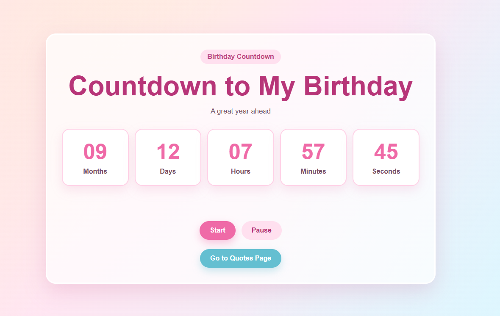
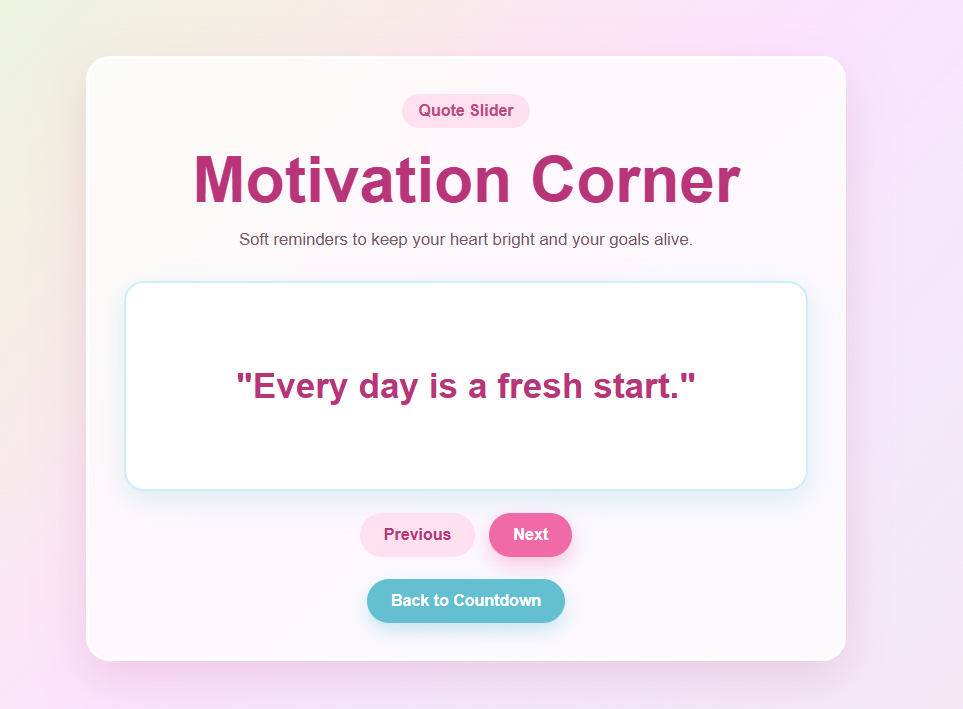
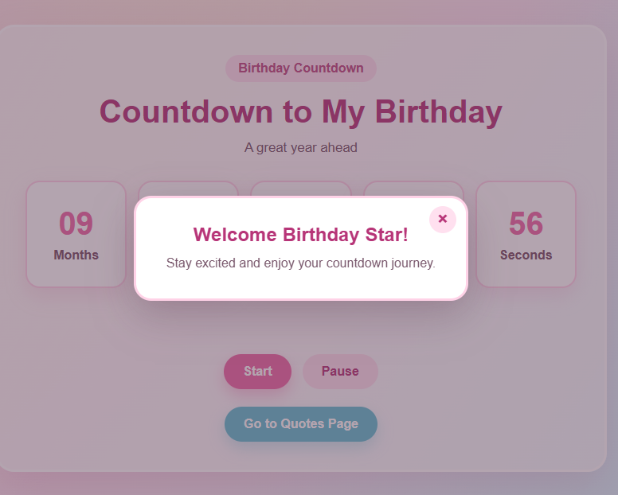

# Countdown & Quotes Application

## Features

- Countdown Timer
- Quotes Slider
- Modal Popup

## JavaScript Concepts Used

- Arrays
- Loops
- Functions
- DOM Manipulation
- Event Listeners
- Conditional Statements
- ES6 Features
- setTimeout()
- setInterval()
- clearInterval()

## Project Structure

```text
Countdown-Quotes-App
│
├── index.html
├── quotes.html
├── style.css
├── script.js
├── quotes.js
└── README.md
```

## Output Screenshots

### Countdown Page



### Quotes Page



### Modal Popup



## Technologies Used

- HTML5
- CSS3
- JavaScript


by pranjal eathod
